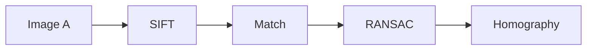
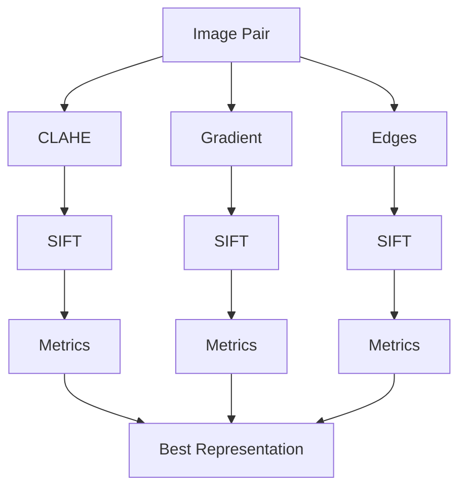
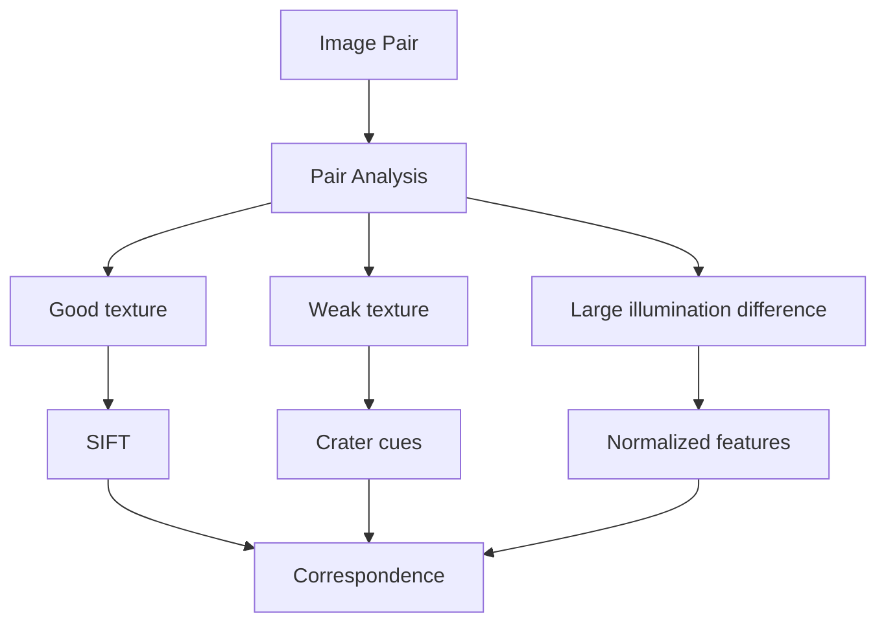
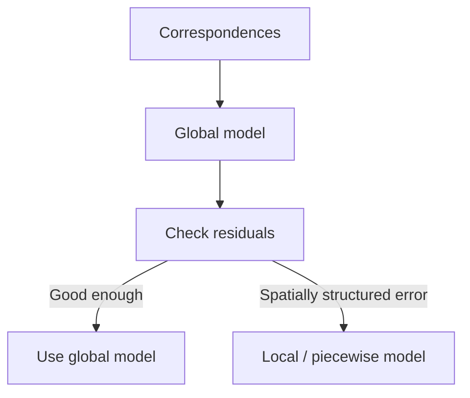
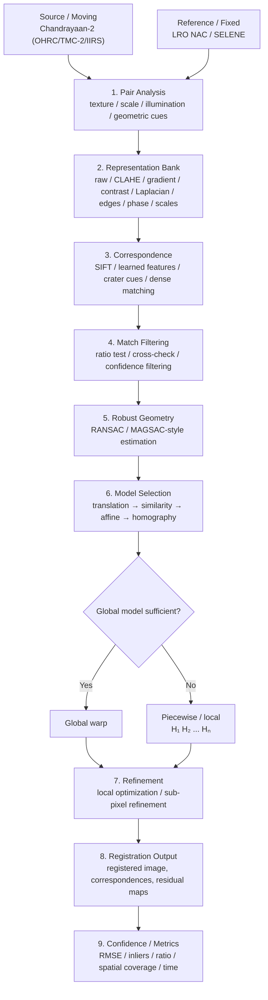
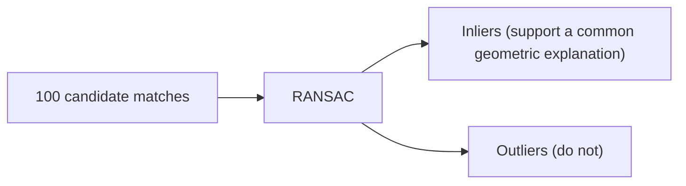
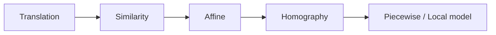
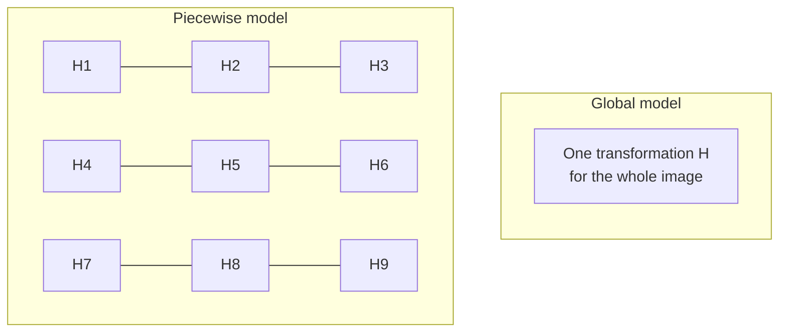
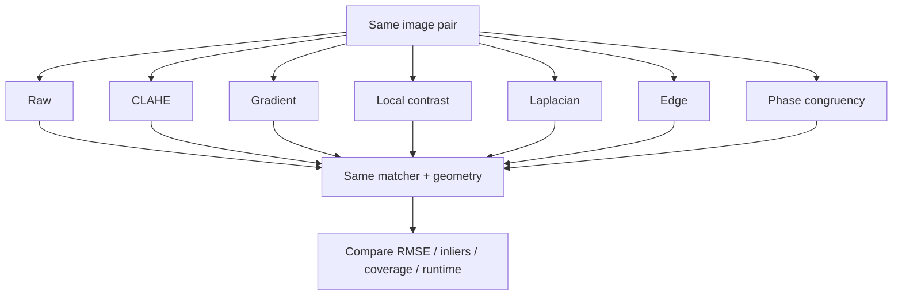
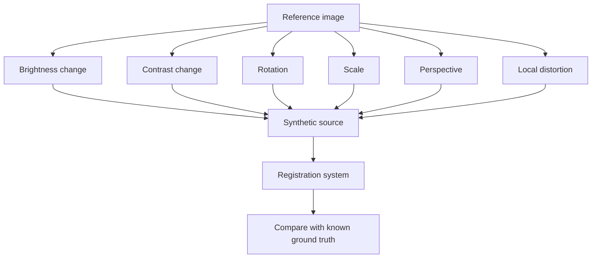

# Lunar Image Registration

### Adaptive, Illumination-Robust and Scale-Aware Image Correspondence for Chandrayaan-2 Optical Imagery

[](https://www.python.org/)
[](#-license)
[](#-project-status)
[](#-research-direction)
[](#-acknowledgements)

> **Research principle:** We don't assume that two lunar images should have similar pixels.
> Instead, identify and match the **terrain structure** that stays useful when illumination,
> scale, viewpoint, and sensor characteristics change.

<p align="center">
  
  
</p>
<p align="center"><sub>
Left: Diophantus crater under low, oblique Sun illumination — dark flow material is only visible because of the shadow geometry (NASA/GSFC/Arizona State University, LROC NAC, PIA14012).
Right: A 320 m ejecta block inside Tycho crater, illustrating the fine surface texture and steep local relief that make lunar terrain a difficult registration target (NASA/GSFC/Arizona State University, LROC NAC, PIA13694).
</sub></p>

---

## 📑 Table of Contents

- [Overview](#overview)
- [Problem Statement](#-problem-statement)
- [Core Research Idea](#-core-research-idea)
- [What Makes This Different](#-what-makes-this-different)
- [End-to-End Pipeline](#️-end-to-end-pipeline)
- [Pipeline Stages 1–9](#-stage-1--image-pair-characterization)
- [Research Benchmark & Adaptive Decision Layer](#-research-benchmark)
- [Literature Context & Figures](#-literature-context)
- [Experimental Matrix & Synthetic Testing](#-experimental-matrix)
- [Project Structure](#-project-structure)
- [Installation & Usage](#-installation)
- [Development Roadmap](#️-development-roadmap)
- [Scientific Validation Rules](#-scientific-validation-rules)
- [Reproducibility & Data Policy](#-reproducibility)
- [Research Direction & Contribution](#-research-direction)
- [License & Acknowledgements](#-license)
- [References](#-references)

---

## Overview

**Lunar Image Registration** is a research-oriented computer-vision framework for finding
reliable correspondences between lunar images and aligning them into a common coordinate
system.

The target use case is cross-sensor and cross-mission lunar imagery, including
Chandrayaan-2 observations such as:

| Sensor       | Instrument                     | Resolution     | Notes                                                                     |
| ------------ | ------------------------------ | -------------- | ------------------------------------------------------------------------- |
| 🛰️ **OHRC**  | Orbiter High Resolution Camera | 0.25–0.32 m/px | Very high-resolution panchromatic, designed for low Sun-elevation imaging |
| 🛰️ **TMC-2** | Terrain Mapping Camera-2       | ~5 m/px        | Panchromatic, stereo triplets (fore/nadir/aft)                            |
| 🛰️ **IIRS**  | Imaging Infrared Spectrometer  | —              | Hyperspectral/mineralogical mapping                                       |

and reference imagery such as:

- **LRO NAC** — Lunar Reconnaissance Orbiter Narrow Angle Camera
- **SELENE/Kaguya** imagery

The SIH problem requires correspondence under changing **Sun angle, scale, viewpoint, and
sensor characteristics**, together with spatially distributed matches and accurate
registration.

Our project goes beyond a fixed `SIFT → RANSAC → Homography` pipeline. The proposed system
is **adaptive**:

1. characterize the image pair,
2. generate illumination-robust terrain representations,
3. choose an appropriate correspondence strategy,
4. estimate and validate the geometric model,
5. fall back from global to local registration when the terrain requires it,
6. refine the result,
7. report quantitative confidence.

The SIH problem statement itself identifies illumination, viewpoint, and scale as central
challenges.

---

## 🎯 Problem Statement

|                              |                                                                                                                           |
| ---------------------------- | ------------------------------------------------------------------------------------------------------------------------- |
| **SIH Problem Statement ID** | 26166                                                                                                                     |
| **Title**                    | _Multi-modal, Sun angle and scale invariant image correspondence using Chandrayaan-2 optical images (OHRC, TMC and IIRS)_ |
| **Organization**             | Indian Space Research Organisation (ISRO)                                                                                 |
| **Category**                 | Software                                                                                                                  |
| **Theme**                    | Space Technology                                                                                                          |

The problem is fundamentally an **image correspondence and registration problem**:

> Given two observations of approximately the same lunar terrain, find reliable
> corresponding points and transform the moving/source image into the coordinate system of
> the fixed/reference image.

The difficulty is that the same terrain may look very different because:

- the Sun illuminates it from a different direction,
- shadows move,
- spatial resolution changes,
- the spacecraft viewpoint changes,
- different sensors have different imaging characteristics,
- terrain relief produces spatially varying geometric distortion.

---

## 💡 Core Research Idea

Traditional registration often starts and ends with:



Our research question is more specific to the Moon:

> **If the pixels change strongly but the underlying terrain structure remains related, can
> we make registration more robust by explicitly representing and selecting stable terrain
> structure?**

Instead of asking only _"do these pixels look similar?"_, we ask:

> **"Does the underlying terrain structure look similar?"**

This motivates a family of candidate representations — not assumptions about which method is
universally best. The benchmark should determine which representation is most stable for
each imaging condition:

- CLAHE / local contrast
- gradient magnitude
- edge maps
- Laplacian structure
- phase congruency
- shadow-suppressed representations
- multi-scale representations

This direction is strongly motivated by planetary-registration literature: lunar/planetary
imagery is known to suffer from low contrast, uneven illumination, shadow effects, weak
textures, and geometric changes. Earlier planetary work explicitly noted that methods
developed for Earth remote sensing do not always transfer cleanly to lunar imagery [1][2].

---

## 🧠 What Makes This Different?

Our proposed contribution is not simply another implementation of SIFT. The system
investigates three connected ideas.

### 1. Representation selection

Different illumination conditions may favor different structural representations.



### 2. Adaptive correspondence

Different image pairs may require different matching strategies.



### 3. Adaptive geometry

We do not assume that one global homography is always sufficient.



The governing principle is:

> **Use the simplest transformation model that adequately explains the observed
> correspondences.**

This avoids both underfitting and unnecessary geometric complexity.

---

## 🛰️ End-to-End Pipeline



---

## 🔬 Stage 1 — Image-Pair Characterization

Before selecting a registration method, the system should estimate what makes the pair
difficult.

**Texture strength.** A feature-rich region contains dense, distinctive local structure,
while a smooth mare region contains little repeatable texture. Useful signals: gradient
density, local variance, edge density, keypoint density.

**Illumination difference.** Compared via intensity distributions, local contrast, gradient
statistics, and shadow/bright-region statistics. The purpose is _not_ to claim exact
physical illumination recovery unless Sun geometry and photometric calibration are
available.

**Scale difference.** Estimated from metadata (where available), image resolution / ground
sampling information, feature-scale statistics, or preliminary correspondence behavior.

**Geometric difficulty.** After initial matching, inspect reprojection error, residual
distribution, and spatial consistency to judge whether a single global model is plausible.

---

## 🌗 Stage 2 — Terrain-Structure Representations

The key idea is to create several views of the same terrain:

| Representation                  | Purpose                                                                                                                                                                                                                                          |
| ------------------------------- | ------------------------------------------------------------------------------------------------------------------------------------------------------------------------------------------------------------------------------------------------ |
| **Raw grayscale**               | Baseline representation                                                                                                                                                                                                                          |
| **CLAHE**                       | Local contrast enhancement — useful when global brightness differences hide local terrain structure                                                                                                                                              |
| **Gradient magnitude**          | Highlights rapid spatial intensity changes: crater rims, scarps, ridges, boundaries                                                                                                                                                              |
| **Edge map**                    | Focuses on structural boundaries rather than absolute intensity                                                                                                                                                                                  |
| **Laplacian**                   | Emphasizes second-order intensity changes and fine structure (can amplify noise)                                                                                                                                                                 |
| **Local contrast**              | Compares a pixel/patch to its local neighborhood rather than absolute brightness                                                                                                                                                                 |
| **Phase congruency**            | Emphasizes significant local phase relationships rather than raw intensity magnitude — of particular interest since recent planetary-registration work has explored multi-scale phase-congruency representations under changing illumination [3] |
| **Shadow suppression**          | Experimental preprocessing to reduce the effect of illumination/shadow regions — aggressive removal can also destroy useful terrain boundaries                                                                                                   |
| **Multi-scale representations** | Large-scale terrain structure (e.g. crater basins) vs. fine-scale structure (small craters); both are useful but behave differently as resolution changes                                                                                        |

<p align="center">
  
</p>
<p align="center"><sub>The dark flow material on the flank of Diophantus crater is only distinguishable because of the raking, low-angle illumination — exactly the kind of illumination-dependent contrast that motivates representation selection instead of raw-pixel matching (NASA/GSFC/Arizona State University, PIA14012).</sub></p>

---

## 🔎 Stage 3 — Correspondence

Once a representation is selected, we extract corresponding terrain features.

### Classical baseline — SIFT

SIFT detects distinctive local structures and constructs descriptors intended to remain
useful under changes such as scale, rotation, and moderate illumination/geometric variation
[4].


A keypoint answers _"where is the distinctive location?"_. A descriptor answers _"what does
its local neighborhood look like?"_. SIFT is our baseline, not our final research claim.

### Learned correspondence

- **SuperPoint** jointly detects interest points and computes descriptors using a fully
  convolutional network, and introduces _homographic adaptation_ to improve repeatability
  [5].
- **LoFTR** takes a different approach: instead of a conventional detector → descriptor →
  matcher sequence, it establishes coarse dense correspondences and then refines them. The
  authors specifically highlight its ability to produce matches in low-texture regions where
  detector-based methods struggle [6] — an interesting property for weak-texture lunar
  terrain.

**Important:** performance on ordinary indoor/outdoor benchmarks does not automatically
imply equivalent performance on lunar imagery. Learned methods are treated as experimental
baselines to be evaluated on the actual lunar domain.

### Crater-based correspondence

Some lunar scenes contain few strong generic keypoints but contain recognizable crater
structures.


This is motivated by planetary navigation and registration literature in which crater
patterns are used as stable lunar landmarks [7]. This module should only be considered
**implemented** once an actual crater detector and geometric matching procedure exist.

---

## 🧹 Stage 4 — Match Filtering

Raw feature matching can produce incorrect correspondences. The baseline pipeline uses
nearest-neighbor matching, the Lowe ratio test, mutual/cross-check filtering, and
descriptor-distance filtering to turn candidate matches into more reliable matches.

---

## 🛡️ Stage 5 — Robust Geometry with RANSAC

Even good descriptor matching can contain false correspondences. RANSAC estimates a
geometric model while tolerating a significant fraction of incorrect observations — a
classic robust-estimation method introduced for model fitting and image-analysis problems
[8].



---

## 📐 Stage 6 — Geometric Model Selection

We do not want to blindly use a homography. The candidate models increase in complexity only
as needed:



A global homography assumes a single relationship between the images — but lunar terrain is
three-dimensional, and different elevations can create spatially varying image displacement
as the viewpoint changes. Therefore:

> **A single homography can fit one part of the terrain well while producing systematic
> residuals elsewhere.**

### Global vs. piecewise registration



The piecewise model is used only if the residual structure justifies it — this prevents
overfitting.

---

## 📍 Stage 7 — Spatially Distributed Matches

A transformation supported only by one small crater cluster can be unstable, so match
distribution is analyzed over a grid, measuring: occupied-cell fraction, match count per
cell, spatial entropy, coverage, and maximum local concentration. This directly supports the
SIH requirement for spatially distributed correspondence.

---

## 🎯 Stage 8 — Registration and Refinement


Where justified, local optimization can refine correspondence locations beyond
integer-pixel coordinates. The system should **not claim sub-pixel accuracy merely because a
sub-pixel optimizer exists** — it must be demonstrated against appropriate ground truth or
reference measurements.

---

## 📊 Stage 9 — Evaluation

Every experiment should produce reproducible metrics.

**RMSE** — for corresponding points $p_i$ and predicted points $\hat{p}_i$:

$$RMSE = \sqrt{\frac{1}{N}\sum_{i=1}^{N}\left\lVert p_i-\hat{p}_i\right\rVert^2}$$

Lower is generally better.

**Inlier ratio:**

$$\text{Inlier Ratio} = \frac{N_{inliers}}{N_{matches}}$$

Higher is generally better.

**Spatial coverage** measures how widely correspondences are distributed across the image.

Additional metrics recorded per run: source/reference keypoints, raw matches, filtered
matches, inliers, reprojection RMSE, spatial coverage, runtime, transformation-model
complexity, and registration success/failure.

---

## 🧪 Research Benchmark

The central benchmark should compare **representations**, not just algorithms:



This lets us ask: **which representation gives the most stable correspondences under
changing lunar illumination?** — and whether the answer changes with terrain type, texture
level, or Sun angle.

### Adaptive decision layer

The eventual system can use interpretable rules rather than a black-box classifier:

| Condition                           | Strategy                                                                 |
| ----------------------------------- | ------------------------------------------------------------------------ |
| Good texture                        | SIFT / SuperPoint → matching → RANSAC                                    |
| Weak texture, visible craters       | Crater cues → geometric crater matching                                  |
| Strong illumination difference      | Illumination-robust representation → feature/learned matching            |
| Small viewpoint difference          | Local feature matching → global model                                    |
| Strong spatially varying distortion | Global model → large structured residuals → piecewise/local registration |

The first implementation should use **transparent rules and measurable thresholds**, not a
black-box classifier.

---

## 📈 Literature Context

This project is grounded in several lines of prior research.

**Lunar / planetary image registration.** Planetary image-feature research has explicitly
reported that lunar imagery can exhibit low contrast and uneven illumination, motivating
specialized feature extraction rather than blindly transferring Earth-remote-sensing methods
[1]. A systematic planetary co-registration study demonstrated multi-instrument registration
across Mars and Moon datasets and focused on robustness to varied image inputs [2]. More
recent work using Chandrayaan-2 lunar data has compared SIFT, ASIFT, AKAZE, RIFT2 and
SuperGlue across cross-modality lunar image pairs, reporting that preprocessing and
illumination conditions materially affect registration performance [9]. Recent lunar-image
studies have also compared classical and learned feature methods across resolution changes
[10].

**Illumination-robust structure.** Recent planetary-registration research has investigated
photometric reliability, phase-congruency representations, brightness inversion and shadow
migration specifically for lunar multi-illumination registration [3]. This strongly supports
making **terrain-structure representation** a first-class research component rather than
treating illumination as a minor preprocessing detail.

**Learned matching.** SuperPoint provides a learned detector/descriptor baseline [5]. LoFTR
provides a detector-free, coarse-to-fine correspondence baseline that is particularly
interesting for low-texture regions [6].

**Open Chandrayaan-2 photogrammetry pipelines.** Independent, open-source photogrammetric
work has also reconstructed sub-metre DEMs directly from OHRC stereo imagery using ISIS and
the NASA Ames Stereo Pipeline, reporting centimetre-to-metre-level triangulation accuracy —
a useful external reference point for what "high precision" means for this sensor
(arXiv:2604.01032, arXiv:2602.14993).

### On literature figures

The diagrams in this README (all the boxes-and-arrows charts above) are **original diagrams
created for this project**. Figures published in the papers below — e.g. LoFTR's
detector-free vs. detector-based comparison [6], SuperPoint's homographic-adaptation figures
[5], or the PWIFT architecture diagram [3] — remain the copyright of their respective
publishers/authors and are **not reproduced here**. When preparing a report or pitch deck,
link to the papers directly (see [References](#-references)) and confirm each paper's reuse
license before including any of their figures.

---

## 🧪 Experimental Matrix

The benchmark should systematically vary:

| Factor         | Example conditions                                |
| -------------- | ------------------------------------------------- |
| Illumination   | low / medium / high Sun-angle difference          |
| Scale          | same / moderate / large scale difference          |
| Viewpoint      | small / medium / large viewpoint change           |
| Texture        | high / medium / low                               |
| Terrain        | crater-rich / mare / mixed                        |
| Representation | raw / CLAHE / gradient / edge / Laplacian / phase |
| Matcher        | SIFT / SuperPoint / LoFTR / crater-based          |
| Geometry       | similarity / affine / homography / piecewise      |
| Metrics        | RMSE / inlier ratio / coverage / runtime          |

The first experiments should use **synthetic data with known transformations**, followed by
controlled lunar-image experiments, and finally real Chandrayaan-2/LRO cross-sensor pairs.

### Synthetic test strategy



This lets us distinguish **algorithm failure** from **dataset / overlap / sensor / metadata
problems.**

---

## 📁 Project Structure

```text
lunar-image-registration/
│
├── configs/
│   ├── default.yaml
│   ├── representations/
│   └── experiments/
│
├── data/
│   ├── synthetic/
│   ├── real/
│   │   ├── ohrc/
│   │   ├── tmc2/
│   │   ├── iirs/
│   │   ├── lro/
│   │   └── selene/
│   ├── processed/
│   ├── patches/
│   └── test/
│
├── notebooks/
│   ├── exploration/
│   └── experiments/
│
├── src/
│   └── lunar_registration/
│       ├── io/
│       ├── preprocessing/
│       │   ├── clahe.py
│       │   ├── gradient.py
│       │   ├── local_contrast.py
│       │   ├── laplacian.py
│       │   ├── edges.py
│       │   └── representations.py
│       ├── features/
│       │   ├── sift.py
│       │   ├── superpoint.py
│       │   └── loftr.py
│       ├── matching/
│       ├── geometry/
│       │   ├── models.py
│       │   ├── ransac.py
│       │   └── model_selection.py
│       ├── registration/
│       │   ├── global.py
│       │   ├── piecewise.py
│       │   └── refinement.py
│       ├── pair_analysis/
│       ├── adaptive/
│       ├── evaluation/
│       │   ├── metrics.py
│       │   ├── spatial.py
│       │   └── confidence.py
│       └── utils/
│
├── scripts/
├── tests/
├── outputs/
│   ├── matches/
│   ├── registered/
│   ├── metrics/
│   └── figures/
│
├── docs/
│   ├── literature/
│   └── experiments/
│
├── requirements.txt
├── pyproject.toml
├── LICENSE
└── README.md
```

---

## 🚀 Installation

```bash
git clone <repository-url>
cd lunar-image-registration

python -m venv .venv
source .venv/bin/activate
pip install -r requirements.txt
```

---

## ▶️ Usage

**Baseline registration**

```bash
python -m lunar_registration.cli register \
    --source data/real/source.tif \
    --reference data/real/reference.tif \
    --config configs/default.yaml
```

**Representation benchmark**

```bash
python -m lunar_registration.cli benchmark-representations \
    --source data/real/source.tif \
    --reference data/real/reference.tif
```

**Adaptive registration**

```bash
python -m lunar_registration.cli adaptive \
    --source data/real/source.tif \
    --reference data/real/reference.tif
```

**Evaluation**

```bash
python -m lunar_registration.cli evaluate \
    --config configs/default.yaml
```

> These commands describe the intended CLI. Keep them synchronized with the actual
> implementation.

### Expected outputs

```text
outputs/
├── registered/
│   └── registered_image.tif
├── matches/
│   ├── raw_matches.png
│   └── inlier_matches.png
├── metrics/
│   └── results.json
└── figures/
    ├── representation_comparison.png
    ├── residual_map.png
    └── spatial_match_distribution.png
```

Example metrics schema (the zero/null values below are a **schema example**, not
experimental results):

```json
{
  "representation": "gradient",
  "feature_method": "sift",
  "keypoints_source": 0,
  "keypoints_reference": 0,
  "raw_matches": 0,
  "inliers": 0,
  "inlier_ratio": 0.0,
  "rmse_pixels": null,
  "spatial_coverage": 0.0,
  "runtime_seconds": 0.0,
  "geometric_model": "homography",
  "confidence": null
}
```

---

## 🛣️ Development Roadmap

| Phase | Focus                               | Key items                                                                                                                                                                                |
| ----- | ----------------------------------- | ---------------------------------------------------------------------------------------------------------------------------------------------------------------------------------------- |
| **1** | Reliable classical baseline         | dataset ingestion, grayscale/CLAHE, SIFT, descriptor matching, Lowe ratio test, RANSAC, homography, warping, RMSE, inlier ratio, match visualization                                     |
| **2** | Illumination-robust representations | representation abstraction, CLAHE/gradient/local-contrast/Laplacian/edge benchmarks, multi-scale representations, phase-congruency & shadow-suppression investigation                    |
| **3** | Representation benchmark            | fixed image-pair benchmark, controlled illumination experiments, RMSE/inlier/coverage/runtime comparison, representation ranking                                                         |
| **4** | Adaptive pair analysis              | texture-strength, illumination-difference, scale-difference, geometric-difficulty analysis, interpretable strategy selection                                                             |
| **5** | Alternative correspondence          | SuperPoint, learned matching, LoFTR, crater-based correspondence, cross-sensor experiments                                                                                               |
| **6** | Terrain-aware geometry              | translation/similarity/affine/homography models, residual-map analysis, model-complexity penalty, piecewise/grid registration, global-vs-local benchmark                                 |
| **7** | High-precision registration         | local optimization, sub-pixel refinement, high-precision error evaluation, spatially uniform control-point selection                                                                     |
| **8** | Final adaptive system               | end-to-end adaptive pipeline, confidence estimation, automated benchmarking, real Chandrayaan-2 experiments, cross-mission experiments, reproducible result package, final documentation |

---

## 🧪 Scientific Validation Rules

This project follows a strict distinction between:

| Status           | Meaning                                                                  |
| ---------------- | ------------------------------------------------------------------------ |
| **Implemented**  | Code exists and has been tested                                          |
| **Experimental** | A method exists but its performance is still being evaluated             |
| **Proposed**     | A research direction has been designed but not implemented               |
| **Demonstrated** | A method has been validated on a defined benchmark with reported results |

Do **not** claim illumination invariance, scale invariance, sub-pixel accuracy,
terrain-aware superiority, or improvement over existing methods until the corresponding
experiments demonstrate them.

---

## 🔁 Reproducibility

Every experiment should record: dataset, source sensor, reference sensor, image pair,
preprocessing, representation, feature method, matcher, ratio threshold, RANSAC method,
geometric model, refinement method, metrics, runtime, random seed, and software version.

Results should be stored as machine-readable JSON/CSV files so experiments can be compared
later.

---

## 📜 Data Policy

Large scientific datasets should **not** be committed directly to Git. Keep them under
`data/` locally, and document dataset source, acquisition metadata, preprocessing
instructions, expected directory structure, and checksums where appropriate.

The project respects the license and redistribution conditions of every dataset, model, and
third-party dependency.

---

## 📊 What Success Looks Like

A successful final system should not simply say `"Registration complete."` It should
produce something closer to:

```text
PAIR
 ├── source: Chandrayaan-2 OHRC
 ├── reference: LRO NAC
 ▼
PAIR ANALYSIS
 ├── texture: medium
 ├── illumination difference: high
 └── spatial distortion: moderate
 ▼
SELECTED REPRESENTATION
 └── gradient + local contrast
 ▼
CORRESPONDENCE
 ├── candidates: ...
 └── reliable matches: ...
 ▼
GEOMETRY
 ├── global homography: insufficient
 └── piecewise model: selected
 ▼
RESULT
 ├── RMSE: measured experimentally
 ├── inlier ratio: measured experimentally
 ├── spatial coverage: measured experimentally
 └── confidence: measured experimentally
```

The values must come from the actual experiment.

---

## 🔭 Research Direction

The long-term research hypothesis is:

> **Lunar image registration can be made more robust by adapting the representation,
> correspondence method, and geometric model to the observable characteristics of the image
> pair rather than applying one fixed registration pipeline to every pair.**

| #                        | Research question                                                                                                                                          |
| ------------------------ | ---------------------------------------------------------------------------------------------------------------------------------------------------------- |
| **RQ1 — Representation** | Which terrain-structure representation produces the most stable correspondences under lunar illumination changes?                                          |
| **RQ2 — Adaptation**     | Can observable pair characteristics predict which correspondence strategy is most reliable?                                                                |
| **RQ3 — Geometry**       | When does a global geometric model fail on non-planar lunar terrain, and when does a piecewise model provide a meaningful improvement without overfitting? |

---

## 🏆 Intended Contribution

The intended contribution is therefore **not** _"we implemented SIFT."_ Instead:

> **We develop and evaluate an adaptive lunar image-registration framework that treats
> illumination-robust representation selection, correspondence strategy selection, and
> global-versus-local geometric model selection as explicit parts of the registration
> problem.**

SIFT, SuperPoint, LoFTR, RANSAC, homography, and crater matching are components/baselines
within that framework.

---

## 📜 License

This project is released under the **MIT License**. The MIT License applies to this
project's original source code and documentation. It does **not** automatically grant
rights to redistribute Chandrayaan-2 data, LRO data, SELENE/Kaguya data, pretrained model
weights, third-party libraries, or figures from external publications — those materials
remain subject to their respective licenses and usage conditions.

See [`LICENSE`](LICENSE) for the full license text.

---

## 🙏 Acknowledgements

Developed as part of **Smart India Hackathon 2026** for the Indian Space Research
Organisation (ISRO), Department of Space. **Problem Statement:** 26166.

The project builds on established work in computer vision, planetary image registration,
lunar feature extraction, robust geometric estimation, and learned feature matching. Mission
imagery credit: NASA/GSFC/Arizona State University (LROC), ISRO (Chandrayaan-2).

---

## 📚 References

1. G. Troglio, J. Le Moigne, G. Moser, S. B. Serpico, and J. A. Benediktsson, **"Automatic Extraction of Planetary Image Features."**
2. P. Sidiropoulos and J.-P. Muller, **"A Systematic Solution to Multi-Instrument Coregistration of High-Resolution Planetary Images to an Orthorectified Baseline,"** IEEE TGRS, 2017. DOI: `10.1109/TGRS.2017.2734693`.
3. Q. Yan, Y. Guo, and X. Zeng, **"Photometric-weighted invariant feature transform for planetary surface image registration under complex illumination,"** Aerospace Science and Technology, 2026. DOI: `10.1016/j.ast.2026.113462`.
4. D. G. Lowe, **"Distinctive Image Features from Scale-Invariant Keypoints,"** IJCV, 2004. DOI: `10.1023/B:VISI.0000029664.99615.94`.
5. D. DeTone, T. Malisiewicz, and A. Rabinovich, **"SuperPoint: Self-Supervised Interest Point Detection and Description,"** CVPR Workshops, 2018.
6. J. Sun, Z. Shen, Y. Wang, H. Bao, and X. Zhou, **"LoFTR: Detector-Free Local Feature Matching with Transformers,"** CVPR, 2021. DOI: `10.1109/CVPR46437.2021.00881`.
7. J. A. Christian, H. Derksen, and R. Watkins, **"Lunar Crater Identification in Digital Images,"** Journal of the Astronautical Sciences, 2021.
8. M. A. Fischler and R. C. Bolles, **"Random Sample Consensus: A Paradigm for Model Fitting with Applications to Image Analysis and Automated Cartography,"** CACM, 1981. DOI: `10.1145/358669.358692`.
9. R. Makharia, J. G. Singla, Amitabh, N. Dube, and H. Sharma, **"Comparative Evaluation of Traditional and Deep Learning Feature Matching Algorithms using Chandrayaan-2 Lunar Data,"** 2025.
10. A. Kumar, S. Kaushal, and S. V. Murthy, **"MoonMetaSync: Lunar Image Registration Analysis,"** 2024.
11. A. Aadi, J. Singla, N. Dube, and O. Alexandrov, **"Sub-metre Lunar DEM Generation and Validation from Chandrayaan-2 OHRC Multi-view Imagery Using an Open-source Pipeline,"** arXiv:2604.01032.
12. C. Tungathurthi, **"Geodetically Anchored 0.30m Digital Elevation Model of the Chandrayaan-3 Vikram Landing Site from Chandrayaan-2 OHRC Stereo Imagery,"** arXiv:2602.14993.

---

## Project Status

🚧 **In Development**

The baseline registration system is being developed first. Advanced adaptive representation
selection, terrain-aware local registration, crater-based matching, learned matching, and
sub-pixel refinement will be introduced and validated incrementally.

> **Build the baseline. Measure it. Break it. Improve it. Then prove the improvement.**
