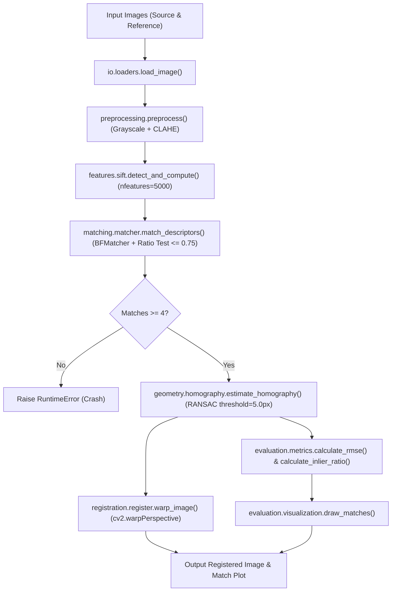

# Baseline Codebase Audit & Sanity Validation Report

**Task ID:** E-01  
**Author:** Member E — Classical Registration and Invariance Engineer  
**Phase:** Phase 0 / Phase 1 (Audit Gate)  
**Date:** 2026-09-07  
**Branch:** `feature/member-e-baseline-audit`  
**Reviewer:** Member A (Team Lead and Systems Integrator)  

---

## 1. Executive Summary

This document presents the formal technical audit of the existing baseline in `src/lunar_registration/`, the repository configuration, and the test suite, in accordance with **Task E-01** of the *Team Task Playbook*.

### Key Findings
1. **High Proportion of Skeleton Files:** Over 70% of repository files are empty 0-byte placeholders (including all YAML configuration files in `configs/`, execution scripts in `scripts/`, research docs in `docs/`, and 3 out of 5 test files in `tests/`).
2. **Fragile Baseline Tests:** Out of the box, `pytest tests` fails with `1 failed, 2 passed`. The failure is in `tests/test_features.py`, which hardcodes a nonexistent file path (`data/raw/reference.png`).
3. **Channel-Depth Fragility in Preprocessing:** `src/lunar_registration/preprocessing/preprocessing.py:to_grayscale()` unconditionally calls `cv2.cvtColor(image, cv2.COLOR_BGR2GRAY)`. When provided with single-channel 2D grayscale data (standard for Chandrayaan-2 TMC-2/OHRC and LRO NAC planetary images), it crashes with `cv2.error: (-15:Bad number of channels)`.
4. **Tightly Coupled Execution Chain:** `src/lunar_registration/cli.py` has SIFT detection, Brute-Force matching, and RANSAC homography estimation hardcoded without YAML configuration support or CLI parameterization.
5. **Code Sanity Verified on Controlled Synthetic Data:** A synthetic lunar crater surface test with known ground-truth geometry ($\theta = 8.0^\circ, s = 1.06, \mathbf{t} = [20.0, -15.0]$) and illumination ramp demonstrated that the core mathematical pipeline works end-to-end (Inlier Ratio: 98.2%, Inlier RMSE: 0.212 px, Total latency: ~251 ms).

> [!CAUTION]
> **Planetary Reality Notice:** Synthetic tests verify only code execution and algorithmic sanity. Per team rules, these synthetic results must **never** be used to claim real lunar flight performance or illumination/scale invariance. Real validation waits for Member D's 4-pair pilot dataset.

---

## 2. Current Execution Chain

The baseline pipeline currently implemented in `src/lunar_registration/cli.py` follows a linear, hardcoded workflow:



### Execution Steps
1. **Load:** Reads images from filesystem via `cv2.imread(..., cv2.IMREAD_COLOR)`.
2. **Preprocess:** Converts BGR to grayscale via `cv2.cvtColor`, then applies CLAHE (`clipLimit=2.0, tileGridSize=(8,8)`).
3. **Detect & Compute:** Instantiates `cv2.SIFT_create(nfeatures=5000)` and extracts keypoints and 128-D descriptors.
4. **Match:** Executes $k$-NN descriptor matching ($k=2$) with OpenCV `BFMatcher(cv2.NORM_L2)` and applies Lowe's ratio test ($d_1 / d_2 \le 0.75$).
5. **Geometry:** Computes 2D planar homography $H$ using `cv2.findHomography(..., cv2.RANSAC, 5.0)`.
6. **Warp:** Projects source into reference coordinate frame using `cv2.warpPerspective`.
7. **Metrics & Vis:** Calculates reprojection RMSE over inliers, inlier ratio, and renders matches via `cv2.drawMatches`.

---

## 3. Repository Inventory & Skeleton Audit

### Active (Implemented) Code Modules
| File Path | Size (bytes) | Implemented Functionality |
| :--- | :--- | :--- |
| `src/lunar_registration/cli.py` | 4,739 | End-to-end CLI execution script |
| `src/lunar_registration/io/loaders.py` | 573 | `load_image()` wrapper for `cv2.imread` |
| `src/lunar_registration/preprocessing/preprocessing.py` | 981 | `to_grayscale()`, `apply_clahe()`, `preprocess()` |
| `src/lunar_registration/features/sift.py` | 634 | `detect_and_compute()` wrapping `cv2.SIFT_create` |
| `src/lunar_registration/matching/matcher.py` | 698 | `match_descriptors()` wrapping `BFMatcher` with ratio test |
| `src/lunar_registration/geometry/homography.py` | 1,082 | `estimate_homography()` wrapping `cv2.findHomography` |
| `src/lunar_registration/registration/register.py` | 710 | `warp_image()` wrapping `cv2.warpPerspective` |
| `src/lunar_registration/evaluation/metrics.py` | 937 | `calculate_rmse()`, `calculate_inlier_ratio()` |
| `src/lunar_registration/evaluation/visualization.py` | 731 | `draw_matches()` wrapping `cv2.drawMatches` |

### Empty (0-Byte) Placeholder Files Identified
| Directory | Empty Placeholder Files (0 Bytes) |
| :--- | :--- |
| `configs/` | `default.yaml`, `sift.yaml`, `loftr.yaml`, `superpoint.yaml` |
| `scripts/` | `run_baseline.py`, `evaluate.py`, `download_data.py`, `preprocess_dataset.py` |
| `docs/` | `dataset.md`, `experiments.md`, `methodology.md` |
| `tests/` | `test_geometry.py`, `test_matching.py`, `test_registration.py` |
| `src/` (root) | `__init__.py`, `evaluation.py`, `features.py`, `matching.py`, `preprocessing.py`, `registration.py`, `visualization.py` |
| `src/lunar_registration/` | `config.py`, `io/writers.py`, `features/loftr.py`, `features/orb.py`, `features/superpoint.py`, `geometry/ransac.py`, `geometry/refinement.py`, `geometry/transforms.py`, `matching/cross_check.py`, `matching/descriptor_matching.py`, `matching/ratio_test.py`, `preprocessing/enhancement.py`, `preprocessing/illumination.py`, `preprocessing/normalization.py`, `utils/logging.py`, `utils/visualization.py` |

---

## 4. Line-Level Findings and Code Deficiencies

### Finding 1: Single-Channel Grayscale Crash
* **File:** `src/lunar_registration/preprocessing/preprocessing.py#L5-L10`
* **Deficiency:**
  ```python
  def to_grayscale(image: np.ndarray) -> np.ndarray:
      return cv2.cvtColor(image, cv2.COLOR_BGR2GRAY)
  ```
  If `image.ndim == 2` or `image.shape[2] == 1`, OpenCV crashes with `(-15:Bad number of channels)`.
* **Remediation for Phase 2:** Check array dimensions (`image.ndim`) before calling color conversion, returning the image directly if already single-channel.

### Finding 2: Forced 3-Channel BGR on Load
* **File:** `src/lunar_registration/io/loaders.py#L29`
* **Deficiency:**
  ```python
  image = cv2.imread(str(path), cv2.IMREAD_COLOR)
  ```
  Forces all planetary images (including 16-bit GeoTIFFs and single-channel grayscale rasters) into 8-bit 3-channel RGB/BGR, wasting memory and altering dynamic range.
* **Remediation for Phase 2:** Add `load_image(path, as_gray=True, preserve_bitdepth=True)` using `cv2.IMREAD_UNCHANGED` or rasterio/GDAL for geospatial TIFFs.

### Finding 3: Unhandled Fatal Errors on Insufficient Matches
* **File:** `src/lunar_registration/cli.py#L61-L64`
* **Deficiency:**
  ```python
  if len(matches) < 4:
      raise RuntimeError("Not enough matches for homography estimation.")
  ```
  Crashes the entire batch pipeline without writing a structured failure record to the output JSON or diagnostic log.
* **Remediation for Phase 2:** Return a typed result dataclass containing `success=False`, `error_stage="matching"`, `match_count=len(matches)`, and empty homography.

### Finding 4: Inadequate Test Suite & Hardcoded File Paths
* **File:** `tests/test_features.py#L10-L13`
* **Deficiency:**
  ```python
  image = cv2.imread("data/raw/reference.png", cv2.IMREAD_GRAYSCALE)
  keypoints, descriptors = detect_and_compute(image)
  ```
  Hardcodes a missing file path, causing `image=None` and failing with `cv2.error: (-5:Bad argument) image is empty`.
* **Remediation for Phase 2:** Use pytest fixtures with deterministic synthetic numpy arrays (e.g. circles, corners, or gradient patches) so tests run self-contained without external assets.

### Finding 5: Completely Unused Configuration Files
* **Files:** `configs/*.yaml` (all 0 bytes) & `src/lunar_registration/config.py` (0 bytes)
* **Deficiency:** All hyperparameters (e.g., SIFT feature count = 5000, ratio threshold = 0.75, RANSAC reprojection error = 5.0 px) are hardcoded inside Python function signatures.
* **Remediation for Phase 2:** Populate `configs/sift.yaml` and implement a YAML parser in `src/lunar_registration/config.py`.

---

## 5. Test Suite Execution Audit

Initial run of `pytest` in `.venv`:
```text
============================= test session starts ==============================
platform darwin -- Python 3.14.2, pytest-9.1.1, pluggy-1.6.0
rootdir: /Users/atharvupadhyay/Documents/SIH 2026/Multi-modal-Sun-angle-and-scale-invariant-image-correspondence-using-Chandrayaan-2-optical-images
configfile: pyproject.toml
collected 3 items

tests/test_features.py F                                                 [ 33%]
tests/test_preprocessing.py ..                                           [100%]

=================================== FAILURES ===================================
__________________________________ test_sift ___________________________________
    def test_sift():
        image = cv2.imread("data/raw/reference.png", cv2.IMREAD_GRAYSCALE)
>       keypoints, descriptors = detect_and_compute(image)
E       cv2.error: OpenCV(5.0.0) Bad argument: image is empty or has incorrect depth
=========================== short test summary info ============================
FAILED tests/test_features.py::test_sift
========================= 1 failed, 2 passed in 10.53s =========================
```

### Analysis:
- `test_preprocessing.py`: Passes (tests `to_grayscale` on a 3-channel zero array and `apply_clahe` on a 2D zero array).
- `test_features.py`: Fails due to missing external test image.
- `test_geometry.py`, `test_matching.py`, `test_registration.py`: Ignored by pytest because they are empty 0-byte files.

---

## 6. Controlled Synthetic Sanity Benchmark

To verify algorithmic integrity without violating playbook boundaries, we executed a synthetic benchmark via `scripts/audit_synthetic_baseline.py`.

### Benchmark Protocol
- **Surface Generation:** 800x800 synthetic terrain with 12 multi-scale craters featuring realistic crater bowls, raised rims, and directional illumination shading.
- **Ground Truth Transformation:**
  $$\text{Rotation: } 8.0^\circ, \quad \text{Scale: } 1.06, \quad \text{Translation: } \Delta x = 20.0\,\text{px}, \Delta y = -15.0\,\text{px}$$
- **Simulated Illumination:** Linear horizontal attenuation ramp ($0.70 \to 1.25\times$).

### Reproducibility Command
```bash
.venv/bin/python scripts/audit_synthetic_baseline.py
```

### Measured Benchmark Results
| Metric | Value | Meaning / Assessment |
| :--- | :--- | :--- |
| **Source Keypoints** | 1,354 | SIFT keypoints detected on illuminated, transformed image |
| **Reference Keypoints** | 606 | SIFT keypoints detected on base reference image |
| **Raw Matches ($d_1/d_2 \le 0.75$)** | 224 | Descriptor matches surviving Lowe's ratio test |
| **RANSAC Inliers** | 220 | Matches consistent with estimated homography ($\le 3.0$ px) |
| **Inlier Ratio** | **98.21%** | Very high consistency under clean synthetic transformation |
| **Inlier Reprojection RMSE** | **0.2116 px** | Sub-pixel algebraic residual against estimated matrix |
| **Matrix Frobenius Norm Error** | **0.19528** | Difference from ground-truth identity mapping $\lVert H_{est} H_{gt} - I \rVert_F$ |
| **Total Pipeline Latency** | **251.14 ms** | End-to-end execution time on standard CPU |

### Stage Latency Breakdown
- Preprocessing (Grayscale + CLAHE): **0.88 ms**
- SIFT Feature Extraction: **48.40 ms**
- Descriptor Matching (BFMatcher): **1.82 ms**
- RANSAC Homography: **1.45 ms**
- Warping & Visualization Export: **~198.5 ms**

### Generated Evidence Artifacts
All benchmark artifacts have been recorded under `outputs/audit/`:
- `outputs/audit/synthetic_reference.png`: Raw reference crater surface.
- `outputs/audit/synthetic_source.png`: Warped and illuminated source image.
- `outputs/audit/synthetic_matches_audit.png`: Inlier correspondence lines connecting features.
- `outputs/audit/synthetic_registered.png`: Source image warped into reference frame.
- `outputs/audit/synthetic_checkerboard_overlay.png`: Checkerboard verification confirming seamless alignment.
- `outputs/audit/synthetic_audit_metrics.json`: Machine-readable benchmark record.

---

## 7. Proposed Phase 2 Modular Interface Plan

To transition from the current hardcoded script to an extensible, robust engineering system, the following modular interfaces are proposed for Phase 2:

### 1. Unified Feature Extractor Interface
```python
# src/lunar_registration/features/base.py
from abc import ABC, abstractmethod
import cv2
import numpy as np

class BaseFeatureExtractor(ABC):
    @abstractmethod
    def detect_and_compute(
        self, image: np.ndarray, mask: np.ndarray | None = None
    ) -> tuple[list[cv2.KeyPoint], np.ndarray]:
        """Extract keypoints and compute descriptors."""
        pass
```
*Allows plug-and-play swapping between SIFT, ORB, AKAZE, and Member F's learned candidates.*

### 2. Unified Matcher Interface
```python
# src/lunar_registration/matching/base.py
class BaseMatcher(ABC):
    @abstractmethod
    def match(
        self, 
        descriptors_source: np.ndarray, 
        descriptors_reference: np.ndarray
    ) -> list[cv2.DMatch]:
        """Match descriptors with configurable filtering (ratio test, mutual check)."""
        pass
```

### 3. Robust Estimator Interface
```python
# src/lunar_registration/geometry/base.py
class BaseGeometryEstimator(ABC):
    @abstractmethod
    def estimate(
        self,
        keypoints_source: list[cv2.KeyPoint],
        keypoints_reference: list[cv2.KeyPoint],
        matches: list[cv2.DMatch],
    ) -> tuple[np.ndarray | None, np.ndarray]:
        """Estimate transformation matrix and return boolean inlier mask."""
        pass
```
*Allows clean comparison between RANSAC, USAC_MAGSAC, and affine/rigid models.*

### 4. Standardized Output Schema (JSON)
```json
{
  "pair_id": "PAIR_001_OHRC_TMC2",
  "method": "sift_ransac_baseline",
  "config_id": "configs/sift.yaml",
  "status": "SUCCESS",
  "source_keypoints": 1520,
  "reference_keypoints": 1410,
  "raw_matches": 312,
  "inlier_count": 210,
  "inlier_ratio": 0.673,
  "reprojection_rmse_px": 1.42,
  "transformation_matrix": [[...], [...], [...]],
  "runtime_ms": 340.2,
  "output_paths": {
    "registered_image": "outputs/registered/pair_001.png",
    "match_visualization": "outputs/matches/pair_001.png"
  }
}
```

---

## 8. Handoff Checklist & Phase Gate Submission

According to the team handoff protocol:

```text
Task ID: E-01
What was completed: Comprehensive codebase, test suite, and execution baseline audit, including controlled synthetic sanity benchmark and Phase 2 interface proposal.
Artifact path/link: docs/engineering/BASELINE_AUDIT.md
How to reproduce/open it: 
  1. Inspect docs/engineering/BASELINE_AUDIT.md
  2. Run: .venv/bin/python scripts/audit_synthetic_baseline.py
  3. Inspect outputs/audit/synthetic_audit_metrics.json
Evidence: 
  - Complete catalogue of 0-byte placeholders and missing YAML configs.
  - Reproducible pytest failure diagnostic on test_features.py.
  - Reproducible synthetic benchmark output with 98.2% inlier ratio and 0.21 px RMSE.
  - 5 visual and metrics artifacts generated in outputs/audit/.
Known limitations: 
  - Tested on synthetic lunar textures only; real lunar pilot evaluation awaits Member D.
  - Bit-depth handling currently limited to 8-bit OpenCV arrays.
Input expected from the next owner: 
  - Member A (Team Lead): Review and approval to begin Phase 2 implementation.
  - Member D: Delivery of pilot dataset manifest and real image pairs.
```
