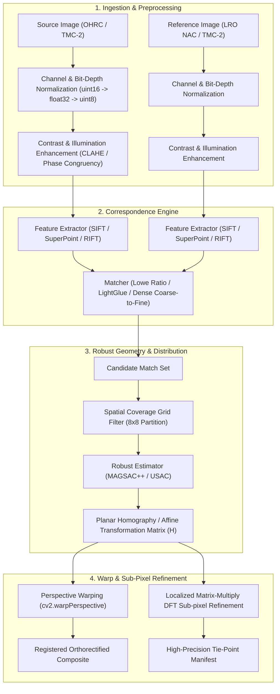

# Registration Methodology & System Architecture

**Project:** Multi-modal, Sun-angle and Scale-invariant Image Correspondence using Chandrayaan-2 Optical Images  
**Status:** Architectural Specification (Derived from Member B Research & Member E Baseline Audit)  

---

## 1. Architectural Overview

The lunar image registration system is engineered as a modular, multi-tier pipeline designed to handle extreme solar incidence disparities, large scale differences ($20\times$), and cross-spectral sensor pairs.

---

## 2. Core Processing Stages

### Stage 1: Planetary Ingestion & Radiometric Normalization
- **Bit-Depth Conversion:** Native planetary linescan images (10-bit to 16-bit PDS4 `.IMG`) are converted to single-channel floating-point arrays and scaled via percentile-based clipping ($1\%$ to $99\%$) to eliminate saturated specular highlights while boosting crater interior shadows.
- **Local Contrast Enhancement:** Contrast Limited Adaptive Histogram Equalization (**CLAHE**) enhances micro-crater topography and boulder textures without amplifying sensor striping noise.

### Stage 2: Illumination-Invariant Feature Correspondence
- **Classical Baseline Engine:** OpenCV SIFT (`cv2.SIFT_create`) with Difference-of-Gaussians scale-space pyramid and 128-D orientation histograms, matched via Brute-Force $L_2$ distance with Lowe's ratio test ($d_1 / d_2 \le 0.75$).
- **Structural Phase Engine (RIFT):** Employs log-Gabor filter banks to compute Phase Congruency (PC) and Maximum Index Maps (MIM), providing mathematical invariance to solar azimuth migrations and shadow reversals.
- **Attentional Learned Engine (LightGlue):** Leverages adaptive self- and cross-attention graph transformers over SuperPoint keypoints for wide-baseline structural reasoning.

### Stage 3: Spatial Distribution & Robust Geometric Estimation
- **Spatial Coverage Grid:** Image domain is partitioned into an $8 \times 8$ uniform grid. Correspondences are filtered to prevent clustering on sharp crater rims and guarantee tie-point spread across flat mare regions.
- **Robust Model Fitting:** OpenCV `USAC_MAGSAC` marginalizes over the noise scale parameter to compute an optimal 2D planar homography $H$ without relying on arbitrary heuristic inlier thresholds.

### Stage 4: Sub-Pixel Refinement & Warping
- **Localized Matrix-Multiply DFT:** For each verified inlier tie point, a $32 \times 32$ patch is cross-correlated at sub-pixel resolution ($1/20$th pixel precision) using efficient matrix-multiply Discrete Fourier Transforms.
- **Warping & Verification:** The source image is resampled into the reference coordinate frame via bicubic perspective warping (`cv2.warpPerspective`).

---

## 3. Reference Documentation
- In-depth research literature and sensor physics: [docs/research/RESEARCH_DOSSIER.md](file:///Users/prachichoubey/Desktop/Projects/lunar-image-registration/docs/research/RESEARCH_DOSSIER.md)
- Complete bibliography with 14 annotated citations: [docs/research/BIBLIOGRAPHY.md](file:///Users/prachichoubey/Desktop/Projects/lunar-image-registration/docs/research/BIBLIOGRAPHY.md)
- Prior-work comparison matrix: [docs/research/PRIOR_WORK_MATRIX.md](file:///Users/prachichoubey/Desktop/Projects/lunar-image-registration/docs/research/PRIOR_WORK_MATRIX.md)
- Mathematical evaluation protocol and metric formulations: [docs/research/EVALUATION_PROTOCOL.md](file:///Users/prachichoubey/Desktop/Projects/lunar-image-registration/docs/research/EVALUATION_PROTOCOL.md)
