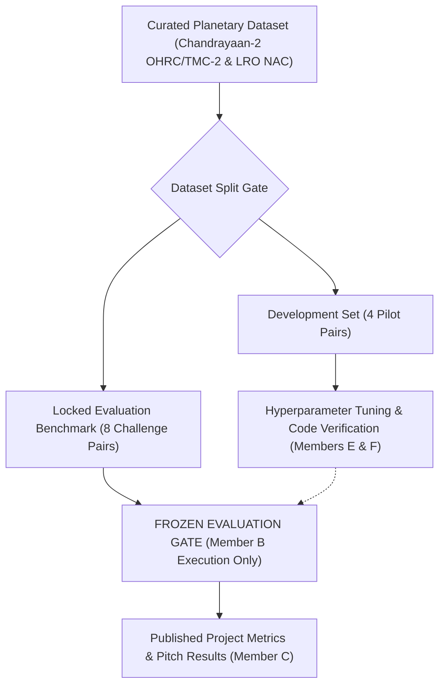
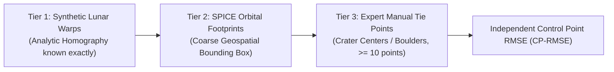

# Evaluation Protocol & Benchmark Standards

**Task ID:** B-01 (Step 5)  
**Author:** Member B — Research, Novelty, and Evaluation Lead  
**Phase:** Phase 0 — Research and Requirements  
**Date:** 2026-09-07  
**Status:** Complete  

---

## 1. Executive Protocol Objectives

To ensure scientific integrity and prevent overclaiming, this protocol establishes the formal evaluation standards, mathematical formulas, data splits, and acceptance gates for all registration pipelines in `lunar-image-registration`.

> [!IMPORTANT]
> **Cardinal Evaluation Rule:** No performance claim (illumination invariance, scale invariance, sub-pixel precision, or registration success) may be made without reproducible execution logs and quantitative metrics evaluated against the locked benchmark split specified in this protocol.

---

## 2. Benchmark Dataset Split Strategy

The evaluation protocol enforces a strict partition between exploratory development data and locked test pairs to prevent data leakage and hyperparameter over-fitting.



### 2.1 Development Set (Pilot Pairs: `DEV-01` through `DEV-04`)
- **Purpose:** Algorithm debugging, interface sanity, synthetic-to-real transfer, parameter grid searches (e.g. SIFT `nfeatures`, RANSAC `threshold`, CLAHE `clipLimit`).
- **Composition (Audited with Member D):**
  - `DEV-01`: TMC-2 Nadir to LRO NAC (Moderate illumination difference: $\Delta \theta_{sun} \le 15^\circ$, similar GSD: $5.0$ m to $1.0$ m downsampled).
  - `DEV-02`: OHRC to LRO NAC (Scale disparity pilot: $0.25$ m to $0.5$ m, moderate Sun angle).
  - `DEV-03`: TMC-2 Fore to TMC-2 Aft (Stereo baseline: in-sensor optical registration, $\Delta \theta_{view} \approx 50^\circ$).
  - `DEV-04`: TMC-2 Nadir to Chandrayaan-2 IIRS (Multimodal optical-to-infrared pilot).

### 2.2 Locked Test Benchmark (`TEST-01` through `TEST-08`)
- **Purpose:** Final scientific evaluation, ablation studies, and paper/pitch figures.
- **Rule:** Hyperparameters must be frozen prior to running on the test set. Code changes may not be introduced based on test set failures.
- **Stratified Challenge Categories:**
  - **Category I — Extreme Sun-Angle / Shadow Inversion (Pairs `TEST-01` & `TEST-02`):** Solar azimuth difference $\Delta \phi_{sun} \ge 90^\circ$ or solar elevation difference $\Delta \theta_{sun} \ge 35^\circ$ across high-relief crater rims.
  - **Category II — Severe Scale Disparity (Pairs `TEST-03` & `TEST-04`):** Resolution ratio $10\times$ to $20\times$ (native OHRC $0.25$ m vs. native TMC-2 $5.0$ m).
  - **Category III — Multimodal Cross-Spectral (Pairs `TEST-05` & `TEST-06`):** TMC-2 visible spectrum ($0.5–0.85\,\mu\text{m}$) vs. IIRS shortwave infrared bands ($1.5–3.2\,\mu\text{m}$).
  - **Category IV — South Pole Permanently Shadowed / Low-Sun (Pairs `TEST-07` & `TEST-08`):** High latitude ($> 75^\circ\text{S}$, Shackleton / Cabeus region) with low solar elevations ($\le 5^\circ$) and deep topographic shadows.

---

## 3. Formal Metric Definitions & Mathematical Formulations

Every registered pair $p$ produces a set of raw candidate matches $\mathcal{M} = \{(x_i, x'_i)\}_{i=1}^N$ where $x_i \in \mathbb{R}^2$ represents source image coordinates and $x'_i \in \mathbb{R}^2$ represents reference image coordinates.

### 3.1 Transformation Error & Reprojection RMSE ($RMSE_{reproj}$)
Given an estimated transformation model $\mathcal{T}$ (e.g. Planar Homography $H \in \mathbb{R}^{3 \times 3}$ or Affine $A \in \mathbb{R}^{2 \times 3}$) and the inlier correspondence set $\mathcal{M}_{inlier} \subseteq \mathcal{M}$:

For homography $H$, the projected coordinate of source point $x_i = [u_i, v_i]^T$ is:
$$\tilde{x}_i = \mathcal{T}(x_i; H) = \begin{bmatrix} \frac{h_{11}u_i + h_{12}v_i + h_{13}}{h_{31}u_i + h_{32}v_i + h_{33}} \\ \frac{h_{21}u_i + h_{22}v_i + h_{23}}{h_{31}u_i + h_{32}v_i + h_{33}} \end{bmatrix}$$

The **Reprojection Root Mean Square Error** is formally defined as:
$$RMSE_{reproj} = \sqrt{\frac{1}{|\mathcal{M}_{inlier}|} \sum_{i \in \mathcal{M}_{inlier}} \|\mathcal{T}(x_i; H) - x'_i\|_2^2} \quad \text{[pixels]}$$

The **Mean Absolute Reprojection Error** ($MAE_{reproj}$) is defined as:
$$MAE_{reproj} = \frac{1}{|\mathcal{M}_{inlier}|} \sum_{i \in \mathcal{M}_{inlier}} \|\mathcal{T}(x_i; H) - x'_i\|_2 \quad \text{[pixels]}$$

> [!CAUTION]
> Reporting $RMSE_{reproj}$ over self-selected RANSAC inliers without a strict inlier count threshold is prone to false claims (e.g., 4 points can always achieve $RMSE = 0.00$ px). Therefore, $RMSE_{reproj}$ is only valid when $N_{inlier} \ge 15$ and Spatial Coverage $\ge 0.25$.

---

### 3.2 Inlier Count ($N_{inlier}$) & Inlier Ratio ($R_{inlier}$)
Let $\tau_{geom}$ be the maximum allowable geometric residual threshold (default $\tau_{geom} = 3.0$ pixels for homography estimation).
$$\mathcal{M}_{inlier} = \{ (x_i, x'_i) \in \mathcal{M} \mid \|\mathcal{T}(x_i) - x'_i\|_2 \le \tau_{geom} \}$$

$$N_{inlier} = |\mathcal{M}_{inlier}|$$

$$R_{inlier} = \frac{|\mathcal{M}_{inlier}|}{|\mathcal{M}|} = \frac{N_{inlier}}{N_{raw}}$$

- **Significance:** $R_{inlier}$ directly measures the discriminative power of the feature extractor and descriptor matcher under illumination/spectral shifts. A baseline where $R_{inlier} < 5\%$ indicates impending consensus failure.

---

### 3.3 Spatial Coverage Score ($C_{spatial}$)
To prevent clustered matches from biasing the transformation, we partition the reference image domain $\Omega_{ref} = W \times H$ into a uniform grid of $G_x \times G_y$ spatial cells (default: $8 \times 8 = 64$ cells).

Let cell $C_{k,l}$ define the spatial region:
$$C_{k,l} = \left[ (k-1) \frac{W}{G_x}, k \frac{W}{G_x} \right) \times \left[ (l-1) \frac{H}{G_y}, l \frac{H}{G_y} \right), \quad 1 \le k \le G_x, \; 1 \le l \le G_y$$

Let $\mathcal{E}$ be the set of **eligible cells** (cells containing valid lunar surface imagery and overlapping with the source footprint; excludes black borders, nodata pixels, and permanently unlit shadow voids):
$$N_{eligible} = |\mathcal{E}| \le G_x \times G_y$$

A cell $C_{k,l}$ is considered **occupied** if it contains at least one confirmed inlier match:
$$\mathbb{I}_{occupied}(C_{k,l}) = \begin{cases} 1, & \text{if } \exists (x_i, x'_i) \in \mathcal{M}_{inlier} \text{ such that } x'_i \in C_{k,l} \\ 0, & \text{otherwise} \end{cases}$$

The **Spatial Coverage Score** is:
$$C_{spatial} = \frac{1}{N_{eligible}} \sum_{C_{k,l} \in \mathcal{E}} \mathbb{I}_{occupied}(C_{k,l}) \in [0.0, 1.0]$$

- **Acceptance Gate:** Any registration resulting in $C_{spatial} < 0.25$ is marked as **Locally Degenerate**, regardless of how low the reprojection RMSE is.

---

### 3.4 Keypoint Repeatability ($Rep$) Under Sun-Angle & Scale Changes
To measure the detector's intrinsic robustness independent of descriptor matching:

Let $\mathcal{K}_1 = \{k_1\}$ and $\mathcal{K}_2 = \{k_2\}$ be the sets of detected keypoints in image 1 and image 2. Given ground truth transformation $\mathcal{H}_{gt}$:
$$Rep = \frac{|\{ k_1 \in \mathcal{K}_1 \mid \min_{k_2 \in \mathcal{K}_2} \|\mathcal{H}_{gt}(k_1) - k_2\|_2 \le \epsilon_{rep} \}|}{\min(|\mathcal{K}_1|, |\mathcal{K}_2|)}$$
Where $\epsilon_{rep} = 3.0$ pixels.

- **Illumination Delta Repeatability Curve:** Repeatability $Rep$ is plotted as a function of solar azimuth difference:
$$\Delta \phi_{sun} = |\phi_{sun, 1} - \phi_{sun, 2}| \in [0^\circ, 180^\circ]$$

---

### 3.5 End-to-End Registration Success Rate ($SR$)
For a benchmark dataset of $P$ test image pairs, pair $p$ is declared **Successfully Registered** ($\mathcal{S}(p) = 1$) if and only if all three validation criteria are simultaneously satisfied:
$$\mathcal{S}(p) = \begin{cases} 1, & \text{if } (N_{inlier}(p) \ge 15) \land (RMSE_{reproj}(p) \le 3.0\text{ px}) \land (C_{spatial}(p) \ge 0.30) \\ 0, & \text{otherwise} \end{cases}$$

The aggregate **Registration Success Rate** is:
$$SR = \frac{1}{|P|} \sum_{p \in P} \mathcal{S}(p) \times 100\%$$

---

### 3.6 Computational Complexity & Hardware Profiling
Every reported experiment must include a complete latency and memory breakdown:
- $t_{io}$: Image loading and channel conversion (ms)
- $t_{prep}$: Grayscale normalization, CLAHE, or phase filtering (ms)
- $t_{feat}$: Feature detection and descriptor generation (ms)
- $t_{match}$: Descriptor matching, ratio test, or neural attention (ms)
- $t_{geom}$: Consensus model fitting (RANSAC / MAGSAC++) (ms)
- $t_{warp}$: Perspective warping and product generation (ms)
- $t_{total} = t_{io} + t_{prep} + t_{feat} + t_{match} + t_{geom} + t_{warp}$
- Peak RAM (MB) and Peak GPU VRAM (MB).
- Hardware standard: Apple Silicon (M-series) CPU/MPS or NVIDIA GPU (CUDA), documented explicitly.

---

## 4. Ground Truth Establishment & Verification Protocol

Because real lunar orbital swaths lack laboratory ground truth fiducial markers, independent ground truth must be established using a verifiable, three-tiered photogrammetric protocol:



### 4.1 Independent Control Point Protocol (Tier 3)
1. For each locked test pair, Member B and Member D identify $K \ge 10$ prominent, geomorphologically stable surface features (e.g. sharp micro-crater central pits, isolated boulder shadows, distinct crater rim junctions) distributed across the 4 quadrants of the scene.
2. Ground truth tie points $\{ (y_j, y'_j) \}_{j=1}^K$ are manually marked with sub-pixel crosshair zooming and saved in an immutable CSV file: `data/test/ground_truth/{pair_id}_control_points.csv`.
3. The estimated model $\mathcal{T}$ (computed strictly using automatic matching) is evaluated against these independent control points:
$$RMSE_{CP} = \sqrt{\frac{1}{K} \sum_{j=1}^K \|\mathcal{T}(y_j) - y'_j\|_2^2} \quad \text{[pixels]}$$
4. If $RMSE_{CP} \le 2.5$ pixels, the registration is independently validated as **Photogrammetrically Sound**.

---

## 5. Experiment Reporting Standard (JSON & Markdown)

Every execution must automatically generate a serialized results record in `outputs/metrics/{experiment_id}.json` containing the following schema:

```json
{
  "experiment_id": "EXP-PHASE2-SIFT-DEV01",
  "pair_id": "DEV-01",
  "source_sensor": "CH2_TMC2_NADIR",
  "reference_sensor": "LRO_LROC_NAC",
  "sun_angle_disparity_deg": 14.2,
  "scale_ratio": 2.1,
  "pipeline_configuration": "configs/sift.yaml",
  "metrics": {
    "num_source_keypoints": 5000,
    "num_ref_keypoints": 5000,
    "num_raw_matches": 842,
    "num_inliers": 312,
    "inlier_ratio": 0.371,
    "reprojection_rmse_px": 1.482,
    "mean_absolute_error_px": 1.120,
    "spatial_coverage_score": 0.531,
    "control_point_rmse_px": 1.840,
    "registration_success": true
  },
  "runtime_ms": {
    "io": 42.1,
    "preprocessing": 38.4,
    "feature_extraction": 182.6,
    "matching": 49.3,
    "geometry": 11.2,
    "warping": 25.4,
    "total": 349.0
  },
  "hardware": {
    "device": "Apple M-Series CPU",
    "ram_peak_mb": 420.5
  }
}
```
