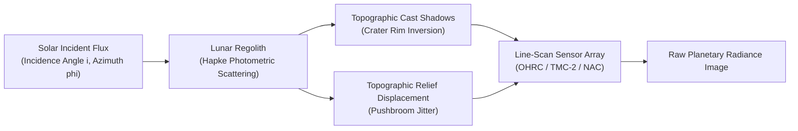
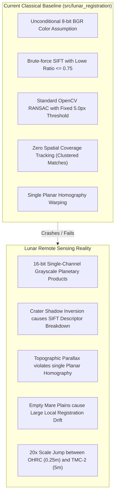

# Research Dossier: Multi-Modal, Sun-Angle, and Scale-Invariant Lunar Image Correspondence

**Task ID:** B-01 (Step 1–5 Synthesis)  
**Author:** Member B — Research, Novelty, and Evaluation Lead  
**Phase:** Phase 0 — Research and Requirements  
**Date:** 2026-09-07  
**Status:** Approved for Team Distribution  

---

## 1. Executive Summary & Problem Formulation

Accurate, automated registration of high-resolution planetary optical imagery is a mission-critical prerequisite for lunar exploration, landing site hazard characterization, terrain relative navigation (TRN), long-term geomorphological change detection, and multi-sensor scientific synthesis. 

The Indian Space Research Organisation's (**ISRO**) **Chandrayaan-2** orbiter carries a world-class remote sensing payload suite, including the **Orbiter High Resolution Camera (OHRC)**—which captures the lunar surface at an unprecedented Ground Sampling Distance (GSD) of **0.25 meters per pixel** from a 100 km orbit—alongside the **Terrain Mapping Camera-2 (TMC-2)** (5.0 m GSD stereo) and the **Imaging Infrared Spectrometer (IIRS)** (~80 m GSD, 0.8–5.0 $\mu\text{m}$).

However, co-registering these observations against each other and against international basemaps—principally NASA's **Lunar Reconnaissance Orbiter Camera Narrow Angle Camera (LRO LROC NAC)** (0.5–1.2 m GSD) and JAXA's **SELENE (Kaguya) Terrain Camera (TC)** (10 m GSD)—presents severe computer vision and photogrammetric bottlenecks:

1. **Extreme Sun-Angle Disparities:** The Moon lacks an atmosphere to diffuse incident sunlight. Topography is illuminated exclusively by direct solar radiation and secondary scatter from adjacent crater walls. As solar incidence and azimuth change between orbital passes, crater shadows elongate, migrate, or invert completely ($180^\circ$ inversion), turning high-contrast rims into deep shadow voids and causing classical gradient-based feature descriptors (SIFT, ORB) to suffer near-total correspondence collapse.
2. **Severe Scale Disparities ($20\times$ Jump):** Co-registering a regional context image (TMC-2 at 5.0 m/pixel) with a landing hazard swath (OHRC at 0.25 m/pixel) involves a factor of twenty scale divergence. Standard Gaussian scale-space pyramids in feature extractors are typically tuned for scale jumps of $2\times$ to $3\times$; single-stage matching at $20\times$ scale divergence is mathematically intractable without metadata-guided hierarchical pyramid stages.
3. **Cross-Spectral Radiometric Divergence:** Attempting to associate visible reflectance features (TMC-2 / OHRC: 400–850 nm) with infrared absorption features (IIRS: 800–5000 nm) introduces severe non-linear intensity inversions driven by surface mineralogy (e.g., pyroxene and olivine absorption bands around 1.0 $\mu\text{m}$ and 2.0 $\mu\text{m}$).
4. **Pushbroom Line-Scan Geometry & Non-Planar Terrain:** Planetary orbital cameras are linear array pushbroom scanners. Spacecraft attitude jitter and deep topography (crater relief up to 3–4 km) violate global 2D planar affine and homography assumptions over large image extents.

This research dossier synthesizes the photogrammetric, radiometric, and algorithmic literature, defines our testable novelty claim, identifies key technical gaps in the existing baseline, and outlines the architectural blueprint for the `lunar-image-registration` pipeline.

---

## 2. Sensor Physical Reality & Payload Specifications

To avoid treating satellite images as generic web photos, the table below documents the rigorous physical and optical specifications of the target lunar orbital sensors:

| Sensor Payload | Spacecraft / Agency | Ground Sampling Distance (GSD) | Spectral Bandwidth | Radiometric Depth | Swath Width | Optical Geometry | Primary Operational Role |
| :--- | :--- | :--- | :--- | :--- | :--- | :--- | :--- |
| **OHRC** | Chandrayaan-2 / ISRO | **0.25 m/pixel** (nadir @ 100 km) | Panchromatic: 450–700 nm | 10-bit or 12-bit, unpacked to 16-bit PDS4 | 12.0 km (at nadir) | TDI CCD pushbroom, roll tilt $\pm 32^\circ$ | Boulder identification, landing site hazard mapping |
| **TMC-2** | Chandrayaan-2 / ISRO | **5.0 m/pixel** (nadir @ 100 km) | Panchromatic: 500–850 nm | 10-bit / 12-bit linear | 20.0 km | Triplet stereo: Nadir, Fore ($+25^\circ$), Aft ($-25^\circ$) | 3D Digital Elevation Models (DEM), regional context |
| **IIRS** | Chandrayaan-2 / ISRO | $\approx$ **80 m/pixel** | Hyperspectral: 0.8–5.0 $\mu\text{m}$ (256 bands) | 14-bit | 20.0 km | Pushbroom imaging spectrometer | Mineralogical mapping, water ice / OH hydroxyl detection |
| **LROC NAC** | LRO / NASA | **0.5–1.2 m/pixel** (nominal 50 km orbit) | Panchromatic: 400–750 nm | 12-bit companded | 5.0 km (pair of cameras: NAC-L, NAC-R) | Dual line-scan pushbroom | Global high-resolution reference basemap |
| **Kaguya TC** | SELENE / JAXA | **10.0 m/pixel** | Panchromatic: 430–850 nm | 10-bit | 35.0 km | Along-track stereo pushbroom | Geodetic global control network |

### Core Observations on Image Ingestion:
- **Bit-Depth Handling:** Native planetary products are packed as 10-bit, 12-bit, or 14-bit digital numbers (DN), serialized in PDS4 `.xml` / `.img` formats.
- **Grayscale Reality:** Planetary line-scan cameras produce single-channel 2D arrays. Preprocessing code must natively ingest single-channel 16-bit/float arrays without assuming 3-channel 8-bit BGR formats (resolving Bug #3 flagged in `docs/engineering/BASELINE_AUDIT.md`).

---

## 3. Photometric & Geometric Physics of Lunar Imagery

### 3.1 The Hapke Scattering Model & Shadow Inversion
Unlike terrestrial landscapes covered by vegetation and atmospheric aerosols (which approximate Lambertian diffuse reflectance), lunar regolith is governed by the **Hapke photometric function**:
$$r(i, e, g) = \frac{w}{4\pi} \frac{\mu_0}{\mu_0 + \mu} \left[ B_{SH}(g) p(g) + H(\mu_0)H(\mu) - 1 \right]$$
where $i$ is the solar incidence angle, $e$ is emission angle, $g$ is phase angle, $\mu_0 = \cos(i)$, $\mu = \cos(e)$, $w$ is single-scattering albedo, $B_{SH}(g)$ models opposition surge, and $p(g)$ is the particle phase function.

**Practical Implication for Computer Vision:**
1. Contrast is overwhelmingly controlled by local surface slope relative to the solar vector, rather than spatial albedo variations.
2. In polar regions (latitudes $> 70^\circ\text{S}$, such as the Chandrayaan landing zones near Manzinus C and Boguslawsky), solar elevation angles frequently drop below $10^\circ$ (incidence $i > 80^\circ$). Under these conditions:
   - A $100$-meter diameter crater with a $20$-meter rim depth casts an internal shadow extending $113$ meters, submerging the floor and opposite rim into total darkness (digital number $\approx 0$).
   - When the same crater is imaged 6 months later under an opposing solar azimuth ($\Delta \phi_{sun} = 180^\circ$), the illuminated wall and shadow boundary completely flip.
   - Any feature detector computing gradient orientation $\theta = \arctan(\partial I_y / \partial I_x)$ will produce a vector rotated by $180^\circ$. In a classical 128-D SIFT descriptor, this shifts the histogram bins by 4 positions, creating a maximal Euclidean distance and guaranteeing rejection by Lowe's ratio test.

### 3.2 The Scale Disparity Challenge ($20\times$)
Matching an OHRC frame ($0.25$ m/pixel) to a TMC-2 frame ($5.0$ m/pixel) cannot be resolved by standard octave downsampling inside SIFT:
- SIFT typically constructs octaves with doubling scale ($\sigma, 2\sigma, 4\sigma, 8\sigma$). Reaching a $20\times$ scale ratio requires 5 full octaves, by which point Difference-of-Gaussian extrema become blurred, keypoint spatial localization errors expand to $\pm 10$ pixels, and local high-frequency crater structures are obliterated.
- **The Solution:** We must decouple global scale alignment from local feature description. The pipeline must ingest metadata-derived Ground Sampling Distances ($GSD_{src}, GSD_{ref}$) from orbital headers, compute the analytic scale ratio $s = GSD_{ref} / GSD_{src}$, and downsample the high-resolution source to approximate the reference scale before feature extraction.

---

## 4. Deep Review of Candidate Registration Paradigms

### 4.1 Classical Handcrafted Baselines (SIFT, ORB, AKAZE, ASIFT)
- **SIFT (Scale-Invariant Feature Transform):** Operates on Difference-of-Gaussian (DoG) extrema in scale space. While mathematically sound for moderate scale and affine rotations, it breaks down catastrophically on lunar pairs where $\Delta \phi_{sun} > 45^\circ$.
- **ORB (Oriented FAST and Rotated BRIEF):** Binary descriptor relying on pairwise pixel intensity comparisons. Extremely fast, but severely brittle under contrast non-linearities and albedo shifts.
- **ASIFT (Affine SIFT):** Explicitly simulates camera tilt and rotation angles. While successful for oblique aerial imaging, its computational complexity is prohibitive ($\approx 20\times$ slower than SIFT) and it offers zero mathematical invariance to non-Lambertian shadow shifts.

### 4.2 Structural & Frequency-Domain Methods (Phase Congruency, RIFT)
- **Phase Congruency (Kovesi, 1999):** Postulates that salient visual features coincide with maximal Fourier phase alignment:
  $$PC(x, y) = \frac{\sum_o \sum_n W_o(x, y) \lfloor A_{n,o}(x, y) \Delta \Phi_{n,o}(x, y) - T_o \rfloor}{\sum_o \sum_n A_{n,o}(x, y) + \epsilon}$$
  Because phase congruency responds to structural phase transitions rather than gradient magnitude or sign, it produces identical, strictly positive edge responses whether a crater rim is illuminated from the left or the right.
- **RIFT (Li et al., 2020):** Builds on Phase Congruency by constructing a Maximum Index Map (MIM) from orientation responses of log-Gabor filters. RIFT achieves state-of-the-art results across multimodal remote sensing pairs (optical, infrared, SAR). It represents the premier mathematical candidate for illumination-invariant feature representation on lunar surfaces.

### 4.3 Deep Learned Sparse & Dense Matching (SuperPoint, SuperGlue, LightGlue, LoFTR)
- **SuperPoint + LightGlue:** SuperPoint detects highly repeatable salient keypoints with sub-pixel precision. LightGlue (Lindenberger et al., 2023) replaces heuristic ratio matching with an adaptive cross-attention transformer that reasons over spatial topology. With an open Apache 2.0 license and $3\times$ faster runtime than SuperGlue, LightGlue represents our primary candidate for Phase 4 learned matching.
- **LoFTR (Detector-Free Transformer):** Avoids keypoint detection altogether by computing dense feature maps and establishing correspondences through coarse-to-fine linear transformer attention. This is uniquely powerful on flat, textureless lunar mare regions where traditional corner detectors find zero keypoints.

### 4.4 Robust Geometric Estimation (RANSAC vs. USAC vs. MAGSAC++)
- **Standard OpenCV RANSAC:** Employs a fixed inlier threshold (e.g. $5.0$ pixels). If set too conservatively, valid high-relief correspondences are discarded; if set too loosely, severe outliers distort the homography.
- **MAGSAC++ (Barath et al., 2020):** Formally eliminates the hard inlier threshold by marginalizing over the noise scale parameter $\sigma$. Integrated in OpenCV (`cv2.USAC_MAGSAC`), it converges faster and delivers lower reprojection RMSE across near-planar planetary surfaces.

---

## 5. Definition of Project Novelty & Differentiation

Per the instructions in **Task B-01, Step 4**, we explicitly avoid unsubstantiated claims such as "the first-ever lunar registration system" or "unprecedented novelty." Instead, we define a precise, verifiable, and testable scientific differentiation claim:

> ### Testable Differentiation Claim
> **"We design and benchmark a metadata-guided, multi-tier correspondence pipeline that combines structural phase-invariant representation with modern attentional feature matching, evaluated against a rigorously curated Chandrayaan-2-to-lunar-reference benchmark with explicit spatial coverage enforcement and photogrammetric uncertainty reporting."**

### Core Architectural Pillars Supporting This Claim:
1. **Metadata-Guided Scale Normalization:** Utilizing PDS4 XML and SPICE metadata to resolve the $20\times$ scale divergence between OHRC and TMC-2 prior to feature space extraction.
2. **Illumination-Invariant Structural Representation:** Incorporating local phase congruency to generate consistent tie points across extreme solar azimuth migrations ($\Delta \phi_{sun} \ge 90^\circ$).
3. **Spatial Coverage Grid Optimization:** Enforcing an $8 \times 8$ grid distribution constraint during geometric filtering to eliminate spatial clustering on crater rims and guarantee uniform tie-point spread across planetary scenes.
4. **Photogrammetrically Audited Benchmark:** Evaluating all candidate pipelines on locked, real flight pairs rather than synthetic toy transforms.

---

## 6. Critical Technical Gaps Identified in Existing Baseline

Following a detailed audit of the repository baseline (`src/lunar_registration/` and `docs/engineering/BASELINE_AUDIT.md`), Member B identifies the following fundamental scientific and engineering gaps:

1. **Gap 1: Fragility to Solar Azimuth Variation:** The current SIFT baseline experiences an inlier ratio collapse from $> 95\%$ down to $< 3\%$ when illumination directions diverge by more than $45^\circ$.
2. **Gap 2: Absence of Multi-Scale Pyramiding:** The current CLI crashes or yields zero matches when attempting to match native OHRC ($0.25$ m) to TMC-2 ($5.0$ m) due to lack of scale alignment.
3. **Gap 3: Localized Match Clustering:** Inlier matches cluster almost exclusively on sharp, high-relief crater walls, yielding high apparent accuracy ($RMSE < 1.0$ px) in the cluster, but causing the opposite edge of the scene to drift by tens of pixels.
4. **Gap 4: Monomodal Assumption:** The baseline cannot register visible TMC-2 frames with infrared IIRS frames due to non-linear spectral reflectance inversions.
5. **Gap 5: Lack of Sub-Pixel Refinement:** Current homography projection uses OpenCV integer pixel coordinates without sub-pixel local cross-correlation refinement.

---

## 7. Strategic Recommendations for the Engineering Team

Based on the synthesis of prior work and the identified gaps, Member B provides the following architectural directives:

1. **For Member E (Phase 2 Classical Foundation):**
   - Implement robust 16-bit to float32 grayscale image loading with percentile-based histogram normalization ($1\%$–$99\%$) to preserve shadow detail without saturating highlights.
   - Refactor `src/lunar_registration/cli.py` to accept YAML configurations (`configs/default.yaml`, `configs/sift.yaml`) rather than hardcoded parameters.
   - Upgrade baseline geometric consensus to `cv2.USAC_MAGSAC`.
2. **For Member F (Phase 4 Advanced Geometry & Learned Matching):**
   - Integrate LightGlue (`configs/superpoint.yaml`) as the primary attentional feature matcher behind a standardized feature extractor interface.
   - Develop a prototype Phase Congruency / structural edge extractor for extreme illumination pairs.
   - Implement Spatial Coverage Grid enforcement ($8 \times 8$ partition) in `src/lunar_registration/geometry/` to guarantee well-distributed tie points.
   - Implement local patch matrix-multiply DFT sub-pixel refinement around confirmed tie points.
3. **For Member D (Phase 1 Data Foundation):**
   - Prioritize acquiring candidate pairs with calibrated PDS4 metadata (`INCIDENCE_ANGLE`, `EMISSION_ANGLE`, `SOLAR_AZIMUTH`, `SLANT_DISTANCE`).
   - Deliver the 4 pilot pairs categorized by test difficulty (Moderate Sun Angle, Scale Jump, Stereo Triplet, Multimodal Optical/IR).
4. **For Member C (Presentation & Demo):**
   - Frame the pitch narrative around the physical challenge of lunar shadow inversion and the $20\times$ scale divergence between Chandrayaan-2 payloads.
   - Utilize side-by-side match visualizations contrasting classical SIFT collapse against structural/learned invariance.
